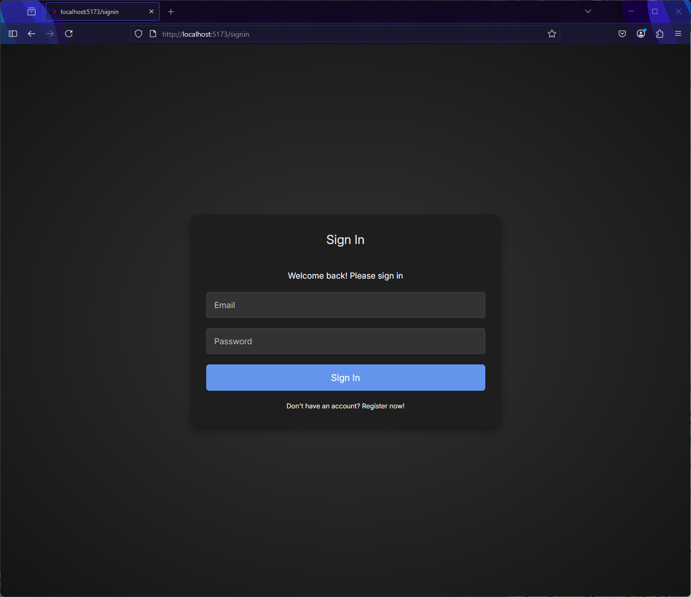
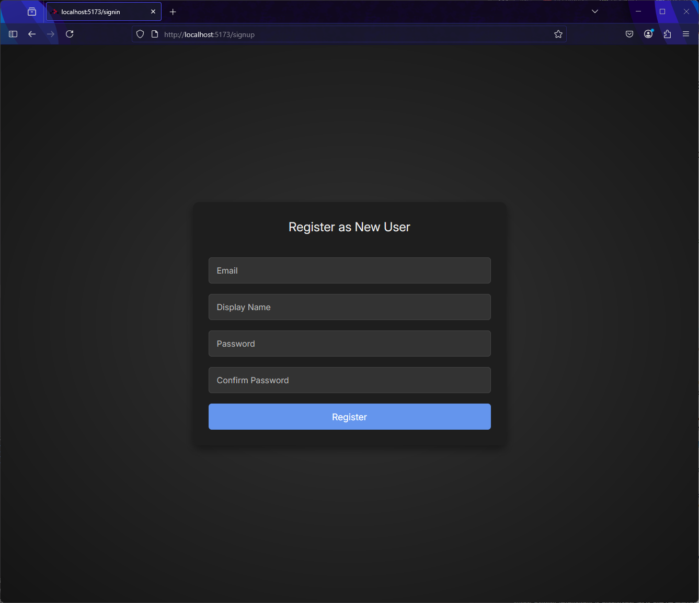
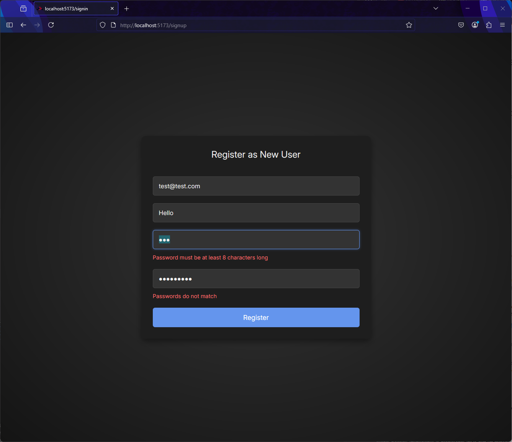
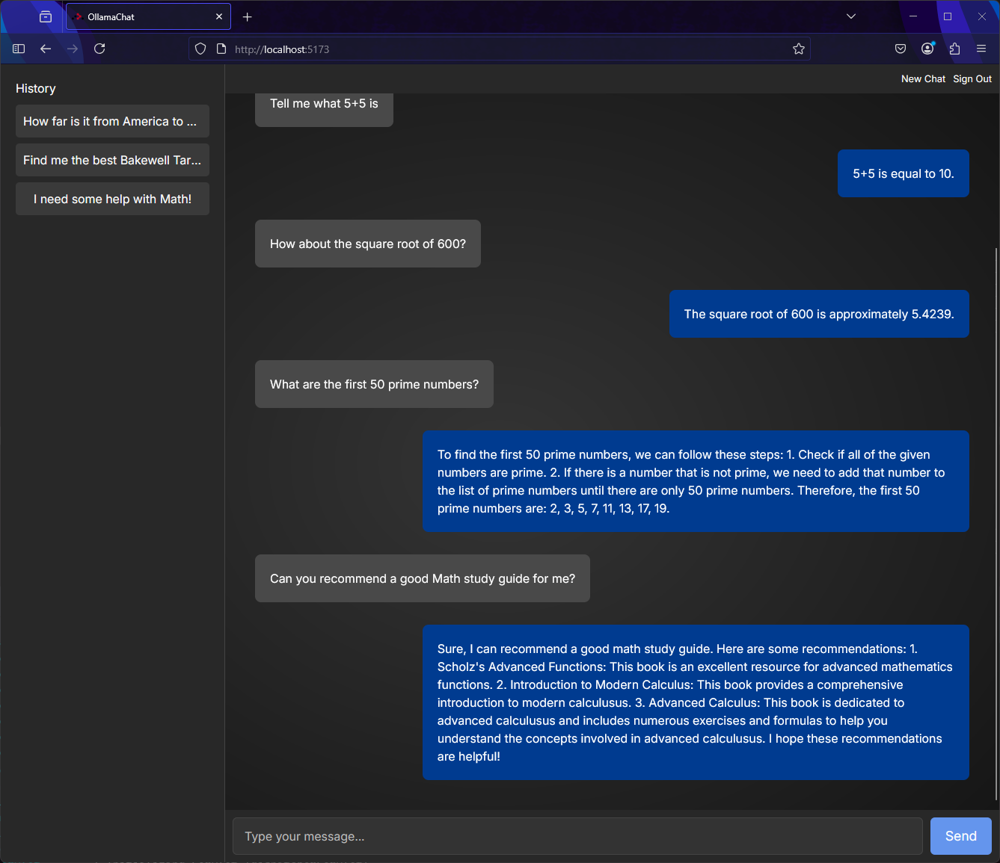

# OllamaChat
OllamaChat is a vertical slice through a React -> Spring application which adds a messenger style UI, authentication, and persistent chat history in front of an Ollama LLM service.

Note: I started this project as TDD but due to time constaints and because this application is not intended for production I switched to PoC development style. Consequently there is not a full set of tests.

## Stack
### Front-end
The front-end web application is built in React on top of React Router 7 framework (with SSR disabled).
* `vite` for dependency and build tools
* `react` for component based composition
* `styled-components` for inline CSS styling 
* `react-hook-form` for form handling and validation
* `react-router` for SPA routing
* `React Testing Library` and `vitest` for testing

### Backend
The backend service is built on Spring Boot using Spring MVC. 
* `Maven` for dependency management and execution
* `Spring Boot` for sensible defaults
* `Spring MVC` for Restful API composition with Controllers, Services, and Repositories
* `Spring Validation` for validating DTO model objects as they come into the API
* `Spring Data JPA` for persisting DAO model objects to a database (H2 in our case)
* `Spring Security` for authentication handling (with a weak custom JWT token based implementation)
* `Lombok` for annotations which generate Java boilerplate (e.g. getters/setters, builders, constructors)
* `mapstruct` for automatic generation of mapping utilities (use to convert DAOs to DTOs)
* `ollama4j` which is a client for Ollama services

## Running locally
### Requirements
* JDK 24
* Any Node LTS
* Docker

### Running the application
#### Start the Ollama service
Start up the Ollama service using Docker with the following command. This will pull the images and start the container. Alternatively you can install Ollama directly using the instructions here - https://ollama.com/download/windows

```
docker run -it --gpus=all -v ~/ollama:/root/.ollama -p 11434:11434 ollama/ollama
```

Note: remove the `--gpus=all` flag to run in CPU mode.

#### Start the OllamaChat backend service
Open the `ollama-chat-server` in your favourite IDE or in the terminal then run the following commands to package and start the application:

```
./mvnw package
java -jar target/ollama-chat-server-0.0.1-SNAPSHOT.jar
```

That will launch the API running on http://localhost:8080/

#### Start the React web application
Open the `ollama-chat-ui` in the terminal and run the following commands:
```
npm install
npm run dev
```
Then open up http://localhost:5173 in your browser.

### Using the application
The server only uses H2 for its persistence database, which is an in-memory database, so data will be lost when the server restarts.

You'll be presented with the Sign In screen:



Unless you've already registered a user this session, you should click the `Don't have an account? Register now!" link, which will take you to the Register New User page:



Fill in your details correctly:



Once complete, you'll be taken back to the Sign In page where you can enter the email and password you just registered with. After which you'll be taken into the application. 



Enter messages in the bottom right of the window. Pressing Return or clicking the Send button will sent the message you've typed.

On the sidebar to the left there is a history of previous chats (retreived from the database) - click any of these to load and resume the chat.

There are buttons in the header to start a new chat or to sign out. Signing out will take you back to the Sign In page.


